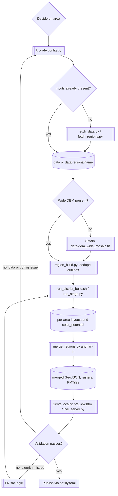

# Dataset operations

Run commands from the `nz-solar-potential` directory with the virtual
environment active. `config.py` is the authoritative definition of pilot and
regional bounding boxes, data-layer identifiers, exclusions, and PV
assumptions.

## Process

This section maps a data-maintenance session to the decisions you make, the
config you update, and where each dataset lives. For code-level module
boundaries, see [architecture.md](../developers/architecture.md).



| Decision or task | What you do | Config or source of truth | Location |
| --- | --- | --- | --- |
| Decide on an area | Choose or add a region name and bounding box | `config.REGIONS`, `config.PILOT_BBOX` | `config.py` |
| Check LINZ coverage | Confirm the area has outlines, DSM, and imagery | LINZ Data Service | https://data.linz.govt.nz |
| Check if inputs already exist | Look before fetching; fetches are resumable and skip existing files | filesystem | `data/` (pilot) or `data/regions/<area>/` |
| Acquire missing inputs | Fetch outlines, DSM, imagery | `fetch_data.py` / `fetch_regions.py` | writes to the same locations |
| Check the wide DEM is present | District-scale bare-earth DEM, not built by this repo | maintained data environment | `data/dem_wide_mosaic.tif` |
| Prepare | Assign overlapping outlines to one owning region | `region_build.py` | `data/regions/<area>/building_outlines_dedup.geojson` |
| Build | Run per-area and district stages, resumable via markers | `run_district_build.sh` / `run_stage.py` | per-area outputs in `data/regions/<area>/`, markers in `data/build_state/` |
| Merge | Combine per-area outputs into site-level datasets | `merge_regions.py` and the district fan-in | `data/*.geojson`, rasters, `data/panel_layouts.pmtiles` |
| Validate | Check logs, run audits, review the map visually | audit/render/validate scripts, local map | `data/build_logs/`, browser |
| Decide: fix data/config or algorithm | A validation failure is either a coverage/config problem or a modelling problem | maintainer judgement | — |
| Correct config or re-acquire | Adjust bbox, exclusions, or assumptions, or refetch | `config.py` | loops back to Build |
| Correct an algorithm | Change segmentation, gating, or model code | `src/*.py` | loops back to Build |
| Publish | Deploy the static site | `netlify.toml` | repo root / hosting |

## Prerequisites

Ensure you have setup your environment, per the [Local Setup](local-setup.md).

## Start the Python environment

Activate your python environment if not done so already. The python environment must be activated at the start of each new Terminal session. The `.venv` folder remains on the computer between sessions.
```sh
cd ~/nz-solar-potential
source .venv/bin/activate
```

If `.venv/bin/activate` is not found, return to [Create the project Python
environment](local-setup.md#create-the-project-python-environment) before
continuing. If activation succeeds, `(.venv)` appears at the start of the
Terminal prompt.

## Choose and prepare an area

Confirm LINZ coverage for the intended area before changing `config.py`. The
configured area names and bounding boxes in `config.REGIONS` are the source of
truth. The original Queenstown pilot is named `pilot` by the build code; its
source files begin in `data/`, while the region-aware build path uses
`data/regions/pilot/` for the pilot area. The repository code comments describe
those pilot inputs as symlinked into the region tree. Check that this link or
equivalent preparation exists before starting a region build.

## Acquire source data

Fetch the original pilot inputs when working with the legacy pilot acquisition
path:

```sh
.venv/bin/python src/fetch_data.py
```

The pilot download is saved in the project's `data/` directory. It includes
`building_outlines.geojson`, `dsm_mosaic.tif`, and `imagery_mosaic.tif`, plus
download and extraction files created while the rasters are processed. When
calculating per-building horizon profiles across wide terrain, ensure the
district-scale bare-earth DEM `data/dem_wide_mosaic.tif` is also present.

For new regional acquisition, prefer `fetch_regions.py`. Fetch one named
expansion region, or omit the name to fetch every configured region:

```sh
.venv/bin/python src/fetch_regions.py frankton_flats
```

This command saves the named region under
`data/regions/frankton_flats/`. Each region directory contains its building
outlines and mosaicked DSM and imagery inputs. For example, replace
`frankton_flats` with the region name passed to the command.

Before a large build, check that the required root-level
`data/dem_wide_mosaic.tif` is present. The build does not create this file;
obtain it from the maintained data environment. Regional imagery is optional,
but the build will report degraded LiDAR-only processing when imagery is absent.

Regional fetching is resumable: existing outputs are skipped. Imagery exports
are split into chunks no larger than $8\,\mathrm{km^2}$ because imagery is the
largest source and provider export jobs have practical size limits. Some rural
areas have no urban aerial imagery; the fetcher records a warning and the
pipeline continues with LiDAR-only inputs.

## Prepare and build

After fetching all regions that will be combined, assign each overlapping
building outline to one owning region. This writes deduplicated outline files
under `data/regions/<area>/` and must happen before region builds:

```sh
.venv/bin/python src/region_build.py
```

For the current resumable district workflow, use:

```sh
bash src/run_district_build.sh
```

Useful options are:

```sh
bash src/run_district_build.sh --regions "pilot frankton_flats"
bash src/run_district_build.sh --force
```

The script gets the area list from `config.REGIONS`, includes `pilot`, and
records stage completion markers so an interrupted run can resume. Its per-area
stages are layout generation, panel gating, reranking, solar-potential
derivation, roof-confidence patching, horizon baking, and heatmap-raster
generation. It then merges regions and runs the district-wide density,
terrain-mask, seasonal-curve, layout-shrink, and PMTiles stages.

Each stage is run through `src/run_stage.py`. Preflight checks verify declared
inputs before expensive work, and successful stages write markers under
`data/build_state/`. With the default resume mode, a stage is skipped only when
its marker is newer than its declared inputs. Use `--force` to rebuild stages.

Logs are written to `data/build_logs/<region>.log`. A failed area stops the
district fan-in, preventing an incomplete set of regions from being presented
as a complete district. The older `run_full_build.sh` remains a simpler
region-loop script for targeted or legacy use; it is not the recommended
district release workflow.

For fast layout-only iteration, use `run_dev_loop.sh`. The parallel layout
rerun scripts are specialized alternatives for gate-rule changes; read their
resource notes before selecting `run_layouts_regate_par.sh`.

The older `run_full_build.sh` does not use the current stage-marker and
preflight orchestration. Use it only when a targeted legacy workflow is
specifically required.

The district script calls `derive_solar_potential.py` and
`bake_building_horizons.py` in the supported stage order. These scripts can
also be run directly for a named region when diagnosing or recovering one
stage. Horizon baking additionally requires the root-level
`data/dem_wide_mosaic.tif`; this file is not built by the repository scripts and
must be copied from the maintained data environment.

## Serve the map locally

Run either command from the `nz-solar-potential` project directory.

For a static preview of generated data, run:

```sh
python3 -m http.server 8000
```

Open `http://localhost:8000/preview.html` in a browser.

For the local parameter-refit API and tuning sliders, run:

```sh
.venv/bin/python src/live_server.py
```

This server loads substantial source data at startup and is intended for local
development only. It serves the project from its parent directory, so open
`http://localhost:8000/nz-solar-potential/preview.html`. Static hosting does
not provide its `/api/refit` endpoint.

## Validate before publishing

1. Read each requested region log for failed stages and warnings.
2. Run `src/audit_layout_quality.py` for rebuilt areas; investigate low fill,
   fragmented arrays, multiple panel angles, and excessive obstruction shares.
3. Run `src/render_top_movers.py` to inspect visual diff cards for the top
   capacity movers across builds before releasing.
4. Use `src/render_building_debug.py <building_id>` to generate visual debug
   cards when investigating individual roof segmentation, plane fits, or
   skeleton reconstruction issues.
5. Use `src/validate_obstructions.py` when changing obstruction behaviour.
6. Use the local map preview to inspect a representative mix of rooftops,
   including known difficult buildings and areas without imagery.
7. Verify merged feature counts and output sizes. Per-area outputs live under
   `data/regions/<area>/`; merged site-level outputs are written to `data/`:
   `solar_potential.geojson`, `panel_layouts.geojson`, heatmap manifests and
   raster outputs. The district workflow also creates
   `data/panel_layouts.pmtiles` for map delivery.

## Run automated checks

From the project directory, run the repository's checks before pushing code or
releasing a dataset:

```sh
bash tests/run_all.sh --fast
```

This runs pure-function checks, economics checks when Node.js is available,
deprecated-API checks, repository-sync checks, and architecture-diagram checks.
The full command, `bash tests/run_all.sh`, also runs the golden-building
regression checks and needs the relevant local region data. A non-zero exit
status means at least one check failed.

## Publish current artifacts

Static hosting publishes the repository root according to `netlify.toml`.
The map can use committed static data, but the local `/api/refit` capability is
not available in static hosting. The current district workflow generates
`data/panel_layouts.pmtiles` for detailed layout delivery and also produces
merged GeoJSON, heatmap rasters, seasonal curves, terrain masks, and density
metadata. Treat these generated artifacts as publication candidates, and keep
the input capture, code revision, configuration, and validation evidence with
the release. Do not deploy the monolithic detailed layout GeoJSON directly to
browsers at full district scale when the PMTiles artifact is available.

## Recovery and safety

- Pipeline writes that replace JSON use atomic replacement, so an interruption
  should retain either the prior artifact or a complete replacement.
- Re-run resumable fetches after a network failure; do not delete complete
  source files merely to retry.
- Preserve source metadata, config changes, command logs, and validation
  evidence with a dataset release so estimates can be traced to their inputs.