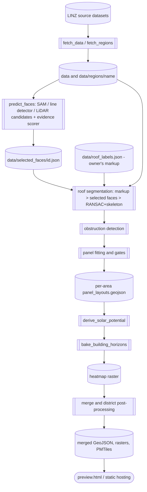

# Architecture for software contributors

> Reviewing rather than contributing? Start with the
> [reviewer's guide](reviewers-guide.md): the two geometry generations,
> the owner's rule constitution mapped to enforcement points, and a
> verification command per stage.

## System shape

`nz-solar-potential` is a local Python geospatial pipeline plus a static
MapLibre web-map frontend. The pipeline derives per-building solar estimates
and panel layouts from LINZ building outlines, elevation data, point clouds,
and aerial imagery. The frontend reads generated data and presents aggregate
and selected-building views.

In this diagram, cylinders represent data or generated artifacts, subroutine
shapes represent executable scripts or processing stages, and the rounded map
node represents the user-facing interface.

The diagram shows the logical flow. The current release orchestration is
implemented by `src/run_district_build.sh`, which wraps individual stages with
`src/run_stage.py` preflight checks and completion markers. Its final fan-in
also runs density deciles, terrain masks, seasonal curves, layout shrinking,
and Tippecanoe PMTiles generation.

## Key boundaries

- `config.py` owns model constants, source layer IDs, area definitions,
  exclusions, and user-visible PV assumptions.
- `src/fetch_data.py` and `src/fetch_regions.py` acquire source inputs.
- `src/region_build.py` resolves paths and assigns overlapping outlines to one
  region before builds. All region-aware tools should use its path helpers.
- The pilot is a special area: acquisition starts with files in `data/`, while
  `area_paths("pilot")` resolves build inputs and outputs under
  `data/regions/pilot/`. The repository currently relies on pilot inputs being
  prepared in that region tree; keep that preparation visible when operating
  a fresh checkout.
- `src/roof_segmentation.py`, `src/roof_partition.py`, and
  `src/roof_skeleton.py` segment roofs into planar facets using RANSAC and
  constructive straight-skeleton methods competing under confidence gates.
- `src/preflight.py` declares stage inputs and provides early failure messages;
  `src/run_stage.py` records stage completion and supports resume-by-marker.
- `src/build_layout_geojson.py`, `src/gate_panels.py`, and
  `src/rerank_layouts.py` fit, gate, and rank physical panel layouts.
- `src/derive_solar_potential.py` aggregates layout outputs into the
  building-summary layer (`solar_potential.geojson`), guaranteeing numerical
  consistency between layout features and building totals without recomputation.
- `src/building_horizon.py` and `src/bake_building_horizons.py` compute
  per-building 72-bin horizon profiles (`horizon_b64`, `horizon_beam_pct`)
  combining wide bare-earth DEM terrain and near DSM obstacles.
- `src/merge_regions.py` produces site-level artifacts. It is the boundary
  between per-region processing and map-facing datasets.
- `src/run_district_build.sh` is the current resumable release orchestrator.
  `src/run_full_build.sh` is an older, simpler orchestration path and should
  not be treated as the complete district architecture.
- `src/render_building_debug.py` and `src/render_top_movers.py` generate visual
  debug cards and build-over-build diff reports for pre-release validation.
- `preview.html` is the static map. `src/live_server.py` adds a local-only
  refit endpoint and must stay behaviourally aligned with the static build.
- `site-config.js` contains deployment-specific map settings such as data
  version, default view, site name, and searchable towns. `economics.js` holds
  pure client-side cost, savings, and payback calculations, separated from the
  page so they can be tested by `tests/test_economics.mjs`.

## Design principles

- Prefer reproducible local builds from versioned code, configuration, and
  source data.
- Preserve geographic correctness: use NZTM2000 for metre-based processing and
  WGS84 only for web-map output.
- Keep regions independent during costly processing to bound memory and enable
  resumable failures.
- Treat generated datasets as contracts. Preserve field names and assumptions
  consumed by the map unless updating producer and consumer together.
- Use deterministic processing where randomness is involved so a building's
  output does not depend on unrelated build order.
- Validate visually as well as geometrically. Roof layout quality is a
  user-visible property not fully captured by containment checks alone.

## Development workflow

Set up the environment using the [data maintainer guide](../data-maintainers/local-setup.md), then make a narrow change and use `bash src/run_dev_loop.sh pilot` for the fastest behaviour check. Run the relevant audit or validation script before a broad regional rebuild. Use `bash src/run_district_build.sh` for a resumable district release and inspect its stage markers and logs.

The repository has a local automated check suite at `tests/run_all.sh`, but no
CI/CD workflow or documentation-site generator is currently documented here.
Run `bash tests/run_all.sh --fast` for a quick check; the full suite adds
golden-building regression tests that require local region data. Add targeted
tests when changing deterministic algorithms or data contracts, and update the
matching document when a command, output, model assumption, or operational
constraint changes.