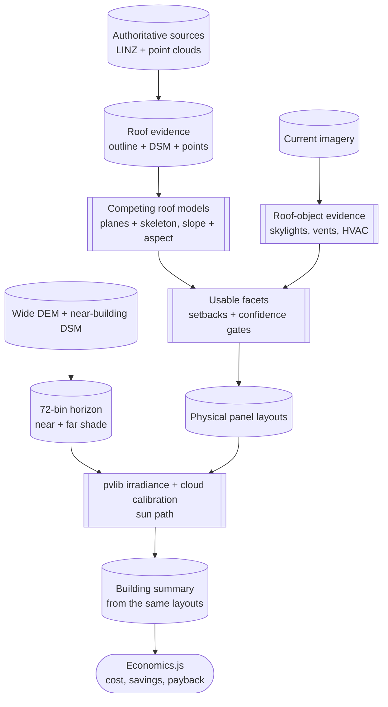

# Why a building estimate can be trusted

## Bottom line

The estimate is trustworthy as a **district-scale planning estimate**, not as
an engineering certificate or an installation quote. Its strength comes from
using several independent, spatially explicit datasets and making the main
uncertainties visible: the building is located from a national authoritative
outline, roof form is inferred from metre-scale elevation data and point
clouds, obstructions are checked against both elevation and imagery, sunlight
is calculated from the resulting roof planes, and the published building total
is derived from the same panel layouts shown on the map.

That is a stronger basis than applying one average roof or one regional yield
factor to every house. It is still limited by capture dates, resolution,
classification errors, missing imagery, and assumptions about future prices and
electricity use. The output should therefore answer *which buildings and roof
areas are promising?*, not *can this system be consented and installed without
further survey?*

## What “accurate” means here

Accuracy has four dimensions:

| Dimension | Question used in this project | Current position |
| --- | --- | --- |
| Organisation | Is the source maintained by an authoritative public provider, or is it a display or calibration source? | LINZ is the primary geospatial authority; OpenTopography is the delivery channel for raw LINZ-associated point-cloud tiles. NASA POWER is a coarse climate calibration source. |
| Granularity | Does the data resolve the feature being modelled? | Building outlines are building-level; DSM/DEM are 1 m products; point clouds retain roof detail; imagery is 0.1 m where available. POWER is much coarser and is not used to locate panels. |
| Coverage | Does it cover every building and the surrounding terrain, and can gaps be detected? | Configured regions are checked against LINZ coverage. The 2021 LiDAR survey does not cover every surrounding settlement, and missing imagery degrades obstruction detection rather than silently fabricating it. |
| Currency | Do the capture dates describe the roof and market being estimated? | The 2021 outline, DSM, DEM, and point-cloud family are internally aligned. Current LINZ imagery is the 2026 layer, improving rooftop currency but introducing a date difference that can expose changed buildings or equipment. |

The repository does not yet claim a statistically independent accuracy
benchmark. Evidence currently consists of source provenance, deterministic
checks, visual review, orientation and terrain sanity checks, and targeted
audits. Historical audit results must be read with their dates and build
versions; they are validation evidence, not a universal error bar.

## Evidence chain

In this diagram, cylinders represent data or generated evidence, subroutine
shapes represent a modelling or detection stage, and the rounded node
represents the user-facing interface -- the same convention used in
[architecture.md](developers/architecture.md).

Each stage narrows a different uncertainty. In particular, the summary layer
is aggregated directly from layout features by
[`src/derive_solar_potential.py`](../src/derive_solar_potential.py), so a user
can inspect the panels behind a building total instead of trusting a separate
calculation path.

## Datasets and their roles

| Dataset | Source and current identifier | Resolution / coverage | Role and confidence |
| --- | --- | --- | --- |
| Building outlines | LINZ Data Service, layer `101290` | Building-level vector outlines; configured regions are checked for coverage | High-confidence location and footprint reference, but not a live survey. Outlines can lag demolition, construction, or boundary changes. |
| DSM | LINZ Data Service, layer `105855`, “Otago - Queenstown LiDAR 1m DSM (2021)” | 1 m surface elevation; 2021 Queenstown LiDAR extent | Primary evidence for roof and nearby-object heights. It resolves broad roof form well, but small equipment and complex edges can be under-resolved. |
| DEM | LINZ Data Service, layer `105898`, “Otago - Queenstown LiDAR 1m DEM (2021)” plus maintained `data/dem_wide_mosaic.tif` | 1 m bare-earth source locally; wide mosaic for surrounding terrain | Strong for terrain horizon and slope context, not for roof objects. It deliberately excludes buildings and rooftop equipment. The wide mosaic is externally maintained and must be provenance-checked when replaced. |
| Raw point cloud | OpenTopography public bulk store `NZ21_Otago`, 2021 tiles associated with the LINZ Otago LiDAR survey | Point-level returns, subject to the survey’s spatial extent and density | More detailed roof evidence than a raster alone; supports plane fitting and residual checks. It is not a guarantee that every roof surface or small object was sampled. |
| Aerial imagery | LINZ Data Service, layer `124754`, “Queenstown 0.1m Urban Aerial Photos (2026)” | 0.1 m imagery for covered urban areas; captured 12 Feb–3 Mar 2026 | Best evidence for visible roof objects and currency. It is appearance-based, affected by shadows and colour variation, and does not directly give height. It can be absent in rural areas. |
| Irradiance calibration | NASA POWER monthly cloud-adjusted values | Coarse regional climate grid and monthly time scale | Useful for correcting clear-sky bias at regional scale. It is not fine enough to distinguish one roof from its neighbour and is not a substitute for local weather instrumentation. |
| Method reference | NIWA SolarView | Methodology reference; no bulk API and non-commercial-use results | Useful for comparison of methods, not a production input or independent ground truth. |
| Map basemap | Esri World Imagery | Display-dependent web imagery | Context for a human reviewer only; not a modelling source. |

The source identifiers and model constants live in
[`config.py`](../config.py). They should be treated as the controlling record
when this page and a generated release disagree.

## Implementation strategy

### Roof form: image, DEM, DSM, or point cloud?

The production strategy combines sources because each answers a different
question:

- **DEM** is the right instrument for bare terrain and distant hills. It is
  stable for horizon calculations but cannot describe a roof because buildings
  have been removed.
- **DSM** includes roofs, trees, and nearby structures. At 1 m it is efficient
  and spatially complete within the survey, but a small skylight, vent, or
  narrow roof break may occupy too few cells to survive rasterisation.
- **Point clouds** preserve more local evidence and allow robust plane fitting
  and residual tests. They cost more to process and still inherit point
  density, occlusion, classification, and survey-date limitations.
- **Imagery** is the most current and finest-grained view of visible objects.
  It can identify a roof object that LiDAR misses, but colour anomaly is an
  indirect signal: shadows, paint, solar panels, dirt, and lighting can all
  look like an obstruction. It supplies little reliable height information.

Roof segmentation therefore lets RANSAC plane fitting and constructive
straight-skeleton reconstruction compete under partition-confidence gates.
Panel placement then uses physical panel dimensions, roof-edge and ridge
setbacks, surface-aware fitting, gating, and reranking. The result is a
feasible potential layout, not a claim that every centimetre of roof has been
surveyed.

### Obstructions and shading

Two obstruction classes are kept separate:

1. Nearby terrain and structures are represented by a 72-bin per-building
   horizon profile. It combines the wide bare-earth DEM with near-building DSM
   obstacles evaluated from eave height.
2. Roof-plane objects such as vents, skylights, HVAC units, and existing arrays
   are detected conservatively from imagery and checked against roof evidence.

Imagery is optional. When it is unavailable, the build continues with
LiDAR-only processing and should be interpreted as less informed about small
roof objects. Conservative image detection reduces false carving but can miss
objects; permissive detection can remove too much usable roof. This trade-off,
including over-carving and missed equipment, remains an explicit validation
risk rather than a hidden accuracy claim.

### Shading distance and compute

Shade is handled as two separate distance scales, because a mountain range
and a neighbour's roof block the sun in the same geometric sense but need
very different search ranges and sampling to stay affordable across tens of
thousands of buildings:

- **Far shade (hills and mountains).** The building's displayed horizon
  searches the wide 8 m bare-earth DEM out to 20 km, stepping every 24 m along
  each ray. A separate, coarser search (2 degree steps, 30 km, 100 m along the
  ray) is computed once per area rather than per building, and sets the
  baseline horizon used by the underlying irradiance lookup table before any
  per-building correction is applied. Both stop well short of a full ray scan
  because horizon angle changes slowly with distance past a few kilometres --
  a coarse step loses little accuracy while keeping each ray to a few hundred
  samples instead of thousands.
- **Near shade (trees and neighbouring buildings).** The same building's
  displayed horizon separately searches the 1 m DSM out to 300 m, stepping
  every 2 m, to catch structures and vegetation close enough to matter at that
  resolution. The actual per-facet yield calculation uses a third, narrower
  search -- 100 m, with a coarser 4 degree azimuth step -- because it runs once
  per roof facet rather than once per building, and this project has tens of
  thousands of facets.

The three searches do not currently share one radius or resolution, and they
feed the model in different ways: the near and far horizons combine by taking
the higher angle in each direction to produce the horizon shown to a user,
while the per-facet search instead scales the irradiance value used for the
published yield. This is a known area for improvement rather than a settled
design: reconciling the per-facet shading distance with the displayed
per-building horizon would remove one source of possible disagreement between
what a user sees on the horizon tab and what the published kWh figure assumes.

### Solar and economic models

The irradiance model uses pvlib sun position and clear-sky calculations from
roof slope, aspect, and latitude, then uses NASA POWER cloud-adjusted values
for regional bias correction. `config.PV_ASSUMPTIONS` is the single source for
the displayed PV assumptions. The building summary is based on the generated
layouts, so panel count, area, orientation, shading, and yield remain linked.

The economic model is the pure client-side [`economics.js`](../economics.js)
implementation, tested by [`tests/test_economics.mjs`](../tests/test_economics.mjs).
It models:

- tiered installed cost by system size;
- separate household and business retail and export rates;
- self-consumption capped by daytime load and annual use;
- linear panel degradation over 30 years;
- a declining export rate, retail-price inflation, and a 3% discount rate;
- an inverter replacement at year 15; and
- discounted lifetime value and payback.

These are scenario assumptions, not observations of a particular customer’s
bill. Economics should therefore be read as sensitivity to the assumptions,
not as a promised return.

## Validation and remaining uncertainty

The practical trust strategy is layered validation:

- source and coverage checks before fetching and building;
- deterministic geometric containment and panel-gating checks;
- solar orientation sanity checks, including higher expected yield for
  north-facing Southern Hemisphere facets than south-facing facets;
- visual review of structurally diverse buildings and debug renders; and
- targeted obstruction, layout-quality, and build-over-build audits.

Known failure modes include stale outlines or imagery, small and curved roofs,
complex roof structures, missed or over-detected equipment, missing LiDAR or
imagery coverage, and economic assumptions that differ from a site’s actual
load, tariff, export limit, access, or installation cost. Structural,
electrical, consent, fire, access, and installer checks remain outside this
model.

The most useful future accuracy work is a dated, stratified reference set of
buildings with surveyed roof facets, obstruction inventories, and measured or
independently modelled generation. It should report errors by roof type,
building size, source coverage, and capture-date mismatch rather than one
district-wide average.